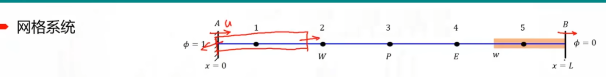

# finite-volume-method

有限体积法（c++实现）

## 2、二维热传导问题

基于扩散项二维热传导问题

如图所示为一个厚度为1cm的板。板材的热导系数为k=1000W/mK。西侧边界事假500kW/m2的稳定热源，南和东侧为绝热，北侧恒温100℃。计算板的温度分布


## 3、一维对流问题

控制方程
$$\left[(\rho u\Delta y\phi)_e-\left(\Gamma^\phi\frac{d\phi}{dx}\Delta y\right)_e\right]-\left[(\rho u\Delta y\phi)_w-\left(\Gamma^\phi\frac{d\phi}{dx}\Delta y\right)_w\right]=0$$



### 3.1 中心差分法（CD）

#### 3.1.1 思想

$$\phi_e=\phi_C+\frac{(\phi_E-\phi_C)}{(x_E-x_C)}(x_e-x_C)$$

#### 3.1.2 控制方程
$$\int\limits_{V_c}\nabla\cdot(\mathbf{J}^{\phi,C}+\mathbf{J}^{\phi,D})dV=\int\limits_{\partial V_c}\left(\mathbf{J}^{\phi,C}+\mathbf{J}^{\phi,D}\right)\cdot d\mathbf{S}=\int\limits_{\partial V_c}\left[\rho u\phi\mathbf{i}-\Gamma^{\phi}\frac{d\phi}{d x}\mathbf{i}\right]\cdot d\mathbf{S}=0$$
1、中间单元
$$a_C\phi_C+a_E\phi_E+a_W\phi_W=0$$
其中
$$a_E=FluxF_e=-\Gamma_e^{\phi}\frac{\Delta y_e}{\delta x_e}+\frac{(pu\Delta y)_e}{2}$$
$$a_W=FluxF_w=-\Gamma_w^\phi\frac{\Delta y_w}{\delta x_w}-\frac{(\rho u\Delta y)_w}{2}$$
$$a_{C}=F l a x C_{e}+F l a x C_{w}=\left({\frac{(\rho u\Delta y)_{e}}{2}}+\Gamma_{e}^{\phi}{\frac{\Delta y_{e}}{\delta x_{e}}}\right)+\left(-{\frac{(\rho u\Delta y)_{w}}{2}}+\Gamma_{w}^{\phi}{\frac{\Delta y_{w}}{\delta x_{w}}}\right)$$

2、对于第一类边界条件（左端）

西侧通量
$$-\bigg[(\rho u\Delta y\phi)_A-\bigg(\Gamma^\phi\frac{d\phi}{dx}\Delta y\bigg)_A\bigg]=-\bigg[\rho u\Delta y\phi_A-\bigg(\Gamma^\phi\Delta y\frac{\phi_C-\phi_A}{\frac{\delta x}{2}}\bigg)_A\bigg] =\mathbf{Flux}C_w\phi_C+\mathbf{Flux}F_w\phi_w+\mathbf{Flux}\mathbf{V}_w$$
其中
$\operatorname{Flux}C_w=\frac{2\Gamma}{\delta x}$；$\operatorname{Flux}F_w=0$；$\operatorname{Flux}V_w=-\rho u\phi_A-\frac{2\Gamma}{\delta x}\phi_A$
东侧通量系数
$$\begin{array}{l}\operatorname*{Flux}C_e=\frac{\Gamma}{\delta x}+\frac{\rho u}{2}\\ \\ \operatorname*{Flux}F_e=-\frac{\Gamma}{\delta x}+\frac{\rho u}{2}\\ \\ \operatorname*{Flux}V_e=0\end{array}$$
则
$$a_C\phi_C+a_E\phi_E+a_W\phi_W=b$$
其中
$$\begin{array}{l}a_E={Flux}F_e=-\frac{\Gamma}{\delta x}+\frac{\rho u}{2}\\ \\ a_W=\mathrm{Flux}F_w=0\\ \\ a_{C}=\operatorname{Flux}C_{e}+\operatorname{Flux}C_{w}=\left({\frac{\rho u}{2}}+{\frac{\Gamma}{\delta x}}\right)+{\frac{2\Gamma}{\delta x}}\\ \\b=-\operatorname{Flux}V_w=\rho u\phi_A+\frac{2\Gamma}{\delta x}\phi_A \end{array}$$

3、对于第一类边界条件（右端）

东侧通量
$$-\bigg[(\rho u\Delta y\phi)_A-\bigg(\Gamma^\phi\frac{d\phi}{dx}\Delta y\bigg)_A\bigg]=-\bigg[\rho u\Delta y\phi_A-\bigg(\Gamma^\phi\Delta y\frac{\phi_C-\phi_A}{\frac{\delta x}{2}}\bigg)_A\bigg] =\mathbf{Flux}C_w\phi_C+\mathbf{Flux}F_w\phi_w+\mathbf{Flux}\mathbf{V}_w$$
其中
$\operatorname{Flux}C_e=\frac{2\Gamma}{\delta x}$；$\operatorname{Flux}F_e=0$；$\operatorname{Flux}V_e=-\rho u\phi_B-\frac{2\Gamma}{\delta x}\phi_B$
西侧通量系数
$$\begin{array}{l}\operatorname*{Flux}C_w=\frac{\Gamma}{\delta x}+\frac{\rho u}{2}\\ \\ \operatorname*{Flux}F_w=-\frac{\Gamma}{\delta x}+\frac{\rho u}{2}\\ \\ \operatorname*{Flux}V_w=0\end{array}$$
则
$$a_C\phi_C+a_E\phi_E+a_W\phi_W=b$$
其中
$$\begin{array}{l}a_E={Flux}F_e=0\\ \\ a_W=\mathrm{Flux}F_w=-\frac{\Gamma}{\delta x}-\frac{\rho u}{2}\\ \\ a_{C}=\operatorname{Flux}C_{e}+\operatorname{Flux}C_{w}={\frac{2\Gamma}{\delta x}}+\left({-\frac{\rho u}{2}}+{\frac{\Gamma}{\delta x}}\right)\\ \\b=-\operatorname{Flux}V_w=-\rho u\phi_B+\frac{2\Gamma}{\delta x}\phi_B \end{array}$$

#### 3.1.3 案例解析
RelaxationGaussSeidel和GaussSeidel适用于对角占优矩阵，用在本案例不合适。本案例使用高斯消去法直接求解

将解析解与数值解进行对比

u = 0.1m/s时，结果为


u = 2.5m/s时，结果为


结果不正确，差距太大。

对网格进行加密，结果可以


$$Pe_{L} = \frac{\rho uL}{\Gamma^{\phi}}$$

这里增加网格数可以减小$Pe_{L}$(表征的是扩散项与对流项之比)

> 为什么会出现这种情况呢？问题出在中心差分格式上。


C点上下游条件对其扩散过程的影响是相同的，而对流过程具有高度的方向性，其只沿着流动方向传输位置。
上下网格点同等权重（如：中心差分法）适用于扩散项，而不适用于具有方性的对流项。使用**阶跃函数**更合适。

根据$Pe_{L}$数，需要
$$-\Gamma_e^{\phi}\frac{\Delta y_e}{\delta x_e}+\frac{(\rho u\Delta y)_e}{2}>0\Rightarrow\frac{(\rho u)_e\delta x_e}{\Gamma_e^{\phi}}>2$$
即$Pe>2$

所以，当$Pe>2$时，离散过程无法保证一致性，因为相邻值的增加反而会使得C点减小。上面的案例通过增加网格数减小佩克莱数使其小于2，有一定的作用，但是会增加存储量，对计算的需求增加。且对于纯流动问题，加密网格是没有作用的，因为没有$Pe$的概念。

全部代码

```c++

```

### 3.2 迎风格式
